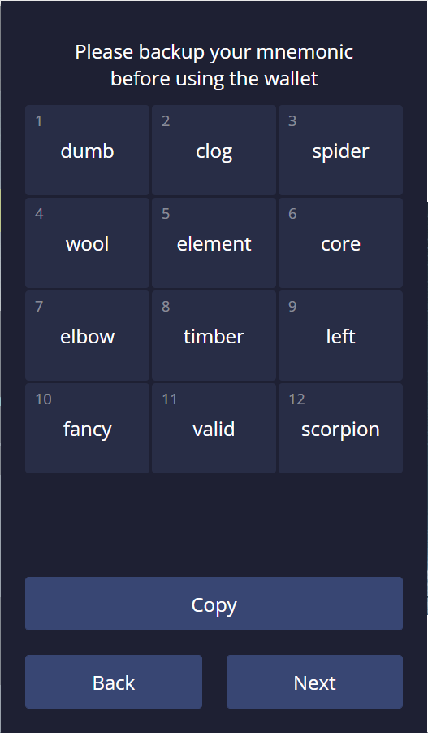
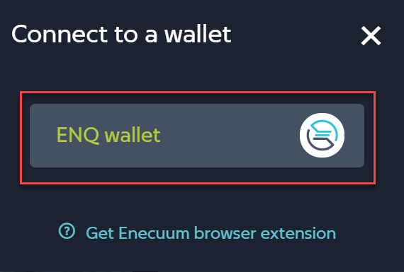

# 💠 Browser Extension

## Getting Started with Enecuum Extension

### Installing Enecuum Browser Extension

## Go to app.enex.space and click **Connect** in the top right corner:

The following window appears. Click **Get Enecuum browser extension** to proceed:

Chrome Web Store opens. Click **Add to Chrome** and confirm the installation by clicking **Add Extension** in the pop-up that appears:

Once the installation is complete, click  _Extensions_ icon to the right of Chrome address bar and click on Enecuum to open the extension. You will be asked to set up a password for the extension:

When you're done setting up the password, you'll be taken to Enecuum extension start view:

Here you can either create a new wallet or log into an existing one. The following sections will describe how to do this.

### Creating a Wallet

1 In the start view, click **Generate**. The generated mnemonic phrase will appear:

If you do not like the mnemonic phrase that was generated, click **Back** to go back to the start view and then click **Generate** to generate a new mnemonic phrase.

If you like the mnemonic phrase that was generated, click **Next** to continue with the creation of your new wallet.

**VERY IMPORTANT**: If you decide to proceed with the generated mnemonic phrase, **back the mnemonic phrase up** before clicking **Next**. You will not be able to recover your mnemonic phrase once the wallet is created. To copy it into the clipboard, click **Copy**.

Also, before you proceed to the next step, keep the mnemonic phrase at hand.

2 Click **Next**. You will be asked twice to pick the correct word from the mnemonic phrase you have just generated:

Click on the word and then click **Next**. When you've successfully picked both requested words, you'll be taken to the view of your new wallet:

Once created, your wallet is not connected to any network. To connect your wallet to the network you started with, click **Connect** on app.enex.space:

Click **ENQ Wallet**:

A confirmation window opens. Click **Allow** to proceed:

You are now connected to the network. You can see this in the top right corner of ENEX view:

Here you can see the following:

* Name of the network (BIT)
* Balance of your wallet in (**which tokens?**)
* Address of your wallet

### Logging into an Existing Wallet

To log into an existing wallet, open Enecuum extension, enter the mnemonic phrase for the wallet and click **Login**.

You will be taken straight to the wallet view (see above).

## Working with Enecuum Extension

Once you're logged in, the extension shows the contents of the wallet:

Window once logged in (screenshots)

_Elements_

> Header: Network name Account properties
>
> > Connection Status (Connected 1 / Not Connected) Account name ("account 1? can you change the account's name?") ("21575" (some number) and weird time stamp I can make no sense of - to be clarified) Token info (\~ currently selected token) token name token balance token balance value in USD Actions Copy = copy wallet public key Send = send tokens to another wallet Assets (overview of the tokens held in the wallet, see further) Activity (activity log for the wallet, see further)

### Assets

This section lists the tokens held in the wallet as follows (screenshot):

> token logo token ticker - short name (check with API?) token balance of the wallet token balance value in USD

### Activity

Activity log (add screenshot)

### Sending Tokens

* click **Send**, the following window appears:

fill in the recipient wallet and the sum and click Send. No further confirmations needed.

screenshot with info

To send another token, select it first by clicking on it in **Assets**, then proceed in the same way.

### Accounts

* add seed phrase (check terms)
* generate seed phrase
* connect ledger --> A ledger is the Enecuum hardware wallet solution. This functionality is being developed now.
* working with private keys
*
  * adding a new private key

### Networks

Enecuum extension supports working with multiple networks. When you install Enecuum for the first time (see above), there's only one network available.

* add network
* switch network
*

click Select on the network's bar in the extension; the window will be redrawn, showing the new network in the header.

* delete network

click X, no confirmation is requested

### DApps

This section allows to work with apps running on the Enecuum network.

DApps thus far:

* Enex (same as the "big" / desktop ENEX, corresponds to the mobile app view)
* Wallet - same as Explorer Wallet interface
* Faucet - add BIT tokens (is it going to go to production?)
* Save - ???

### Set Password

When you've first launched the extension, it will ask you to set a password

(requirements for a password, checks?)

Enter the password twice and click **Save**.

### (e.) Window - ???

### Popup Window - ???

### Logout (and be taken back to the beginning)

Click cogwheel icon in the extension -> Log out.

All of your data, including the private key and the access password for the extension, will be deleted. You're back to square 1.
