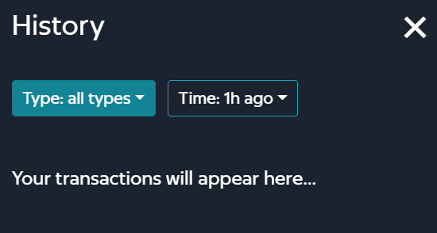

# 🔄 Swap


**Good to know:** you always can test all the features of ENEX.SPACE in the test network. Visit [app.enex.space](https://app.enex.space/) and select BIT network in the extension. Read more about this in the section: ENEX in Test Network


ENEX.SPACE provides a simple way to exchange digital assets by means of a swap operation.

For each swap operation, ENEX.SPACE charges a fixed transaction fee of 0.35% that is broken down as follows:

* 0.30% is returned to the liquidity pool as a reward for liquidity providers working with it
* 0.05% goes to the Treasury Fund.

When you add liquidity to a pool, you get Liquidity Provider tokens (LPTs) of that pool in return. The more LPTs you have, the larger is your share in the pool. If you want to withdraw the liquidity you had added to the pool earlier, you are to return the corresponding amount of LPTs, using the exchange rate at the withdrawal moment.

## Getting Started with Swap

First, you go to the site and select the swap tab or visit it via [link](https://app.enex.space/#!action=swap).

.png>)

Next, you will see the tools for using it.

It has the following parts:

* Transaction Settings and History
* Token Pair Settings
* Price and Routing Information
* Swap Button
* Transaction Overview

## General Swap Settings

### Transaction Settings

To view or edit **Transaction Settings**, click (cogwheel icon). The following window appears:

.png>)

Here you can edit the _slippage tolerance_. This means that, if the price change exceeds this value, the transaction will be reversed.

### Slippage

**Slippage** is a common occurrence in markets with high volatility or low liquidity. Slippage occurs when a trade settles for a different price than expected or requested.\
\
In other words, for small orders of high-demand assets, slippage can be relatively insignificant or even unnoticeable on the chart. However, a large order of an asset with less liquidity brings with it a higher probability of slippage. Slippage, therefore, holds an inverse correlation to liquidity: higher market liquidity reduces slippage, while low liquidity in the market will increase the percentage of slippage.

#### Positive Slippage‍

Slippage doesn’t necessarily mean that you’ll end up with a worse price than expected. **Positive slippage** can occur if the price decreases while you make your buy order or increases if you make a sell order. Although uncommon, positive slippage may occur in some highly volatile markets.

#### Slippage Tolerance‍

Enex allows you to manually set a **slippage tolerance level** to limit any slippage you might experience. And we also allow you to change this level!

.png>)

### Transaction History

To view transaction history, click (clock-backwards). The following window appears:

Here you can view the history of your transactions. You can refine your view using the dropdown menus:

* Transaction Type: you can either select all transaction types or one of the following transaction types: _swap_, _pool_, _farms_, _drop_.
* History Period: you can select whether you want to see the transactions from the last hour, last 12 hours, or last day.

## Token Pair Settings

This section lets you select the source token (**From**) and the target token (**To**) you want to swap.

.png>)

**From** has the following fields:

* **Token amount box** to enter the amount of source tokens you want to swap. To select all source tokens to be swapped, click **MAX**.
* **Balance** shows the current amount of source tokens in your wallet.
* **Token Selector** allows you to select your source token to be swapped. When you click on it, the following menu appears:

 (1).png>)

You can look up for the source token as you type in its name.

You can also have your preferred tokens appear first on the menu. To do this, click (cogwheel icon). The following menu appears:

.png>)

The dropdown lists all tokens in an A to Z order. Click the arrow to change the sorting order to Z to A.

You can select one or more priority settings:

* **Raise up trusted tokens**: trusted tokens (?) appear on top of the list
* **Raise up tokens with non zero balance**: non-zero tokens appear on top of the list
* **Raise up LP tokens**: liquidity providers' tokens appear on top of the list

To invert the source and the target token in the swap pair, click the arrow separating them.

## Price and Routing Information

This section shows the price of the target token measured in source tokens.

In addition, it shows the routing information, collapsed by default. To view it, click **Router**.

 (1).png>)

0.3% - it is a swap fee for each pair.

The routing information lists the following parameters of the transaction:

* **LP Reward Bar (0.3% on the screenshot)**: liquidity provider's reward for the swap
* **From**: source token amount
* **To**: target token amount
* **Minimum received**: the minimum amount of a token that can be received (depending on the slippage).

## Swap Button

Click this button to send a transaction. If the transaction cannot be sent, the error reason is shown on the button.

.png>)

## Transaction Overview

This section contains the following transaction parameters:

* **Maximum sent** - the maximum amount of source tokens that can be sent with the current slippage tolerance settings
* **Price impact** - the impact on the transaction on the price after the transaction is completed
* **Liquidity provider fee** - ENEX.SPACE fixed fee for this transaction.

### Swap Confirmation

When you click **Swap**, this confirmation window appears:

.png>)

Click **Confirm Supply** to proceed.

When you've clicked **Confirm Supply**, Enecuum Wallet extension opens this window:

.png>)

By clicking **Confirm**, you confirm you agree to pay the liquidity provider's fee for this transaction.

After successful confirmation, the following window is shown:

 (1).png>)

You can click **View on...** to open the Explorer view of the transaction or just **Close** to close it.
