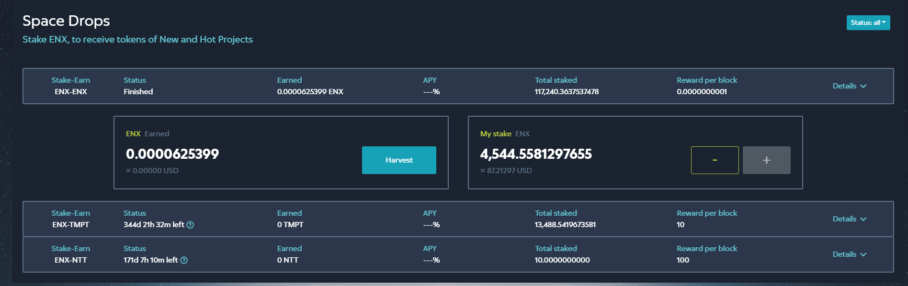
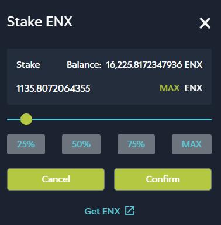

# 🌍 Space Drops

**Space Drops** are similar to [**Space Station**](station-not-ready.md). They allow you to earn rewards as you stake ENX tokens. The difference is that with **Space Drops**, the reward is accumulated and eventually converted not from liquidity pool tokens issued to stakeholders, but from the other token of a given pair pair.

## Getting Started with Space Drops

Space Drops are available [here](https://dev.enex.space/#!action=space-drops). Alternatively, click **Space Drops** on the **ENEX.SPACE** sidebar.

The following view opens:

The Space Drops view contains the following information for each pool:

* **Stake-Earn** - name of the pair of tokens staked in the pool.
* **Status** - pool status. The status can be _Active_, _Paused_ (what does **Paused** stand for?) or _Finished_. You can use the Status selector on top of the table to select whether you want to see all Space Drops or just those in a specific status. For _Active_ Space Drops, the remaining time of life of the Space Drop is shown in days, hours and minutes. If you hover over **??** next to the remaining time of life, the last date and time of the Space Drop's existence as well as the remaining time of life in blocks are shown
* **Earned** - rewards you've earned in this pool.
* **APY** - annual percentage yield (the real rate of return on the investment in a Space Drop)
* **Total Staked** - total amount of tokens staked in the Space Drop.
* **Reward per Block** - the reward earned by a stakeholder of a Space Drop.
* **Details** - click here to see the amount of ENX you have earned in Rewards from this Space Drop and your stake in the Space Drop.

## Working with Space Drops

### Creating a Space Drop

(is it possible to do so at all?)

### Staking ENX

If you have no stakes in the SpaceSpace Drop yet, click **Details** for that Space Drop and click **Stake ENX**. The following window appears:

Enter the amount of ENX tokens you want to stake and click **Confirm**. Your Enecuum wallet will request confirmation for the writing off of a transaction fee. Once the transaction is complete, Space Station view will be updated, reflecting your current stake.

If you wish to stake more ENX tokens or remove some or all of them from Space Station, use **+** or **-** buttons to the right of your current stake as shown in the Space Drop's **Details** view. The steps are the same as described above for the initial staking of ENX tokens.

### Harvesting Rewards

Harvesting means collecting the rewards that have been accumulated for you. To harvest your rewards, click **Harvest** in the Space Station view.

Your Enecuum wallet will request confirmation for the writing off of a transaction fee. Once the transaction is complete, the **Space Station** view will be updated, reflecting the changes in the sum of rewards you can claim for yourself.
