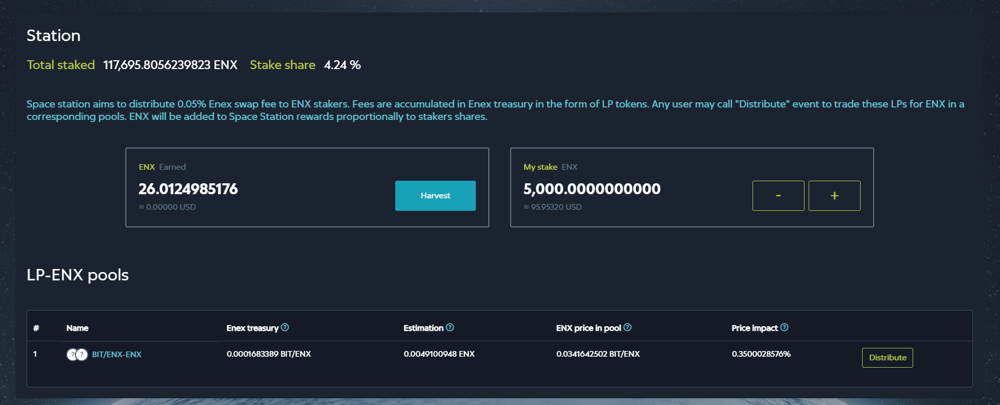
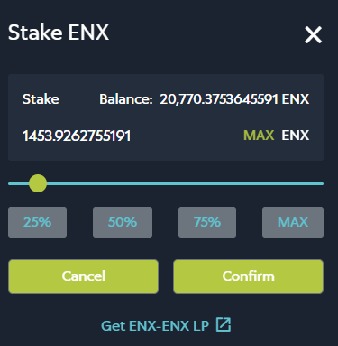
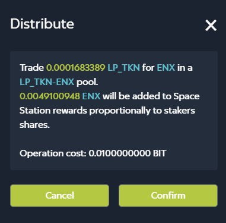

# 🛰 Station

The rationale behind **Space Station**, much as with **Harvest Farms**, is to encourage ENEX.SPACE users to keep ENX liquidity in liquidity pools.

When a transaction is performed on **ENEX.SPACE**, 0.05% of the transaction fee, in LP tokens, goes to the Treasury Fund. If a user has a stake in a liquidity pool that holds both LP tokens and ENX tokens, he can call Distribute to trade the LP tokens in the pool for ENX and distribute them to the stakeholders of the pool, in proportion to their stakes.

## Getting Started with Station

Space Station is available [here](https://dev.enex.space/#!action=space-station). Alternatively, click **Station** on the **ENEX.SPACE** sidebar.

The following view opens:

The Space Station view contains the following information:

* **Total Staked** - total amount of ENX liquidity staked on **ENEX.SPACE**.
* **Stake Share** - your share in the pool of staked ENX liquidity.
* **ENX Earned** - the reward you have earned thus far, in ENX as well as in USD (**how is the USD value determined?**)
* **My Stake** - your ENX stake, in ENX and USD likewise.

**LP-ENX Pools** lists the liquidity pools in which you have stakes, and from trades in which you are earning rewards. The columns of this table are as follows:

* **#** - number of the liquidity pool.
* **Name** - name of the liquidity pool, based on the pair of tokens staked in that pool. Click the name of a pool to open it in the **Pool** interface.
* **ENEX Treasury** - total amount of LP tokens accumulated in the Treasury Fund that can be distributed to stakeholders.
* **Estimation** - estimated total amount of rewards that can be distributed to stakeholders, once LP tokens are converted into ENX.
* **ENX Price in Pool** - price of an ENX token calculated in LP tokens, using the data from the pools in the Space Station.
* **Price Impact** - the expected change in the ENX price after the distribution of stakeholder rewards, in percentage points.

## Working with Space Stations

## Staking ENX

If you have no stakes in the Space Station yet, the Space Station view looks as follows:

To stake ENX, click **Stake ENX**. The following window appears:

Enter the amount of ENX tokens you want to stake and click **Confirm**. Your Enecuum wallet will request confirmation for the writing off of a transaction fee. Once the transaction is complete, Space Station view will be updated, reflecting your current stake.

If you wish to stake more ENX tokens or remove some or all of them from Space Station, use **+** or **-** buttons to the right of your current stake. The steps are the same as described above for the initial staking of ENX tokens.

## Harvesting Rewards

Harvesting means collecting the rewards that have been accumulated for you. To harvest your rewards, click **Harvest** in the Space Station view.

Your Enecuum wallet will request confirmation for the writing off of a transaction fee. Once the transaction is complete, the **Space Station** view will be updated, reflecting the changes in the sum of rewards you can claim for yourself.

## Distributing Rewards

Whereas harvesting, as described above, means collecting just your own rewards, _distributing_ triggers reward distribution to **all** stakeholders of a liquidity pool that participates in the Space Station.

To distribute rewards, click **Distribute** in the pool's line. The information window appears:

This window describes how many LP tokens are being traded for ENX and how many ENX tokens will be distributed as rewards to stakeholders.

Click **Confirm** to proceed with the distribution of rewards. After confirming the transaction fee with your Enecuum wallet, the system will perform the transaction. The information about the liquidity pool will be updated, reflecting the current state of the ENEX.SPACE treasury fund. If you do not wish to proceed, just click **Cancel**.

## The example

For example, there are two shareholders A and B with shares of 10 and 40 ENX respectively. So, A share is 20% and B share is 80%. Let 60 ENX are sent to Station over some period of time. Then, shareholder A will be rewarded with 12 ENX (20% of 60 ENX), and shareholder B will be rewarded with 48 ENX (80% of 60 ENX).
